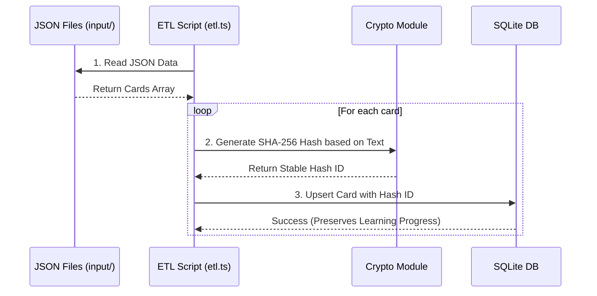

# System Architecture

This document defines the system architecture of the `memorize_supporter` project.

이 문서는 `memorize_supporter` 프로젝트의 시스템 아키텍처를 정의합니다.

## 1. Overview

**Purpose:** A general-purpose memorization application designed to help users efficiently memorize flashcards (pinpoint tips), multiple-choice questions, and vocabulary. It maximizes learning efficiency by adopting cognitive science principles (Active Recall, Spaced Repetition) and a focus-mode design.

**목적:** 사용자가 플래시카드(핀포인트 팁), 객관식 문제, 영단어 등을 효율적으로 암기할 수 있도록 돕는 범용 암기 애플리케이션입니다. 인지 과학적 원리(Active Recall, Spaced Repetition)와 포커스 모드 디자인을 채택하여 학습 효율을 극대화합니다.

**Core Components:**
- `DeckGallery`: Client-side component for real-time deck search and series filtering, optimized with `useDeferredValue`.
- `DeckPlayer`, `Flashcard`, `VocabularyCard`, `PracticeQuizCard`: Frontend interactive card renderer (handling micro-animations and feedback).
- `SQLite & Prisma`: Lightweight data layer operating in an offline (local file) environment.
- `ETL Script`: Data pipeline script that reads original documents (JSON), parses them, and pushes them (Upsert) into the DB.

**핵심 컴포넌트:**
- `DeckGallery`: `useDeferredValue`를 활용한 렌더링 최적화와 함께 실시간 덱 검색 및 시리즈 필터링을 담당하는 클라이언트 컴포넌트
- `DeckPlayer` 및 세부 카드 컴포넌트들: 프론트엔드 인터랙티브 카드 렌더러 (마이크로 애니메이션, 피드백 처리)
- `SQLite & Prisma`: 오프라인(로컬 파일) 환경에서 동작하는 경량 데이터 레이어
- `ETL Script`: 원본 문서(JSON)를 읽고 파싱하여 DB에 밀어넣는(Upsert) 데이터 파이프라인 스크립트

## 2. Frontend

**Framework and Routing Strategy:**
- Next.js (App Router) / React 19
- Optimizes rendering performance by strictly separating Server Components (data fetching: `app/[lang]/deck/[deckId]/page.tsx`) and Client Components (interactions: `Flashcard.tsx`).

**프레임워크 및 라우팅 방식:**
- Next.js (App Router) / React 19
- Server Components(데이터 패칭: `app/[lang]/deck/[deckId]/page.tsx`)와 Client Components(인터랙션: `Flashcard.tsx`)를 명확히 분리하여 렌더링 성능을 최적화합니다.

**Card Selection Strategy (카드 출제 전략):**
- **Priority 1 (Unasked):** Cards with no learning history are presented first to ensure full coverage of the deck.
- **Priority 2 (Incorrect):** Cards with a history of incorrect answers are prioritized next, sorted descending by their estimated failed count to target weaknesses.
- **Priority 3 (General):** Cards perfectly answered are presented last, sorted ascending by their review count to solidify newer knowledge before re-testing heavily drilled cards.
- **카드 출제 전략:** 
  1순위(미출제 문제): 학습 기록이 없는 카드를 최우선 출제하여 덱 전체 커버리지를 확보합니다. 
  2순위(오답 문제): 틀린 이력이 있는 카드를 추산된 '틀린 횟수'가 높은 순으로 배치하여 약점을 집중 타격합니다. 
  3순위(일반 문제): 완벽히 맞힌 카드는 '풀이 횟수'가 적은 순으로 출제하여 우연히 맞힌 지식을 확실히 굳힌 뒤, 장기 기억화된 카드를 나중에 복습하도록 설계되었습니다.

**i18n Strategy & Product UX Writing (다국어 처리 및 UX 라이팅 전략):**
- **URL as Single Source of Truth (SSoT):** Uses dynamic routing (`app/[lang]/...`) to manage the current language state. This prevents hydration errors caused by resolving language through cookies or local storage during SSR.
- **다국어 처리 전략:** URL 기반 동적 라우팅(`app/[lang]/...`)을 단일 진실 공급원(SSoT)으로 활용합니다. 전역 상태 관리자(Zustand 등)를 배제하여 SSR 렌더링 시점의 쿠키 분석에 의존하지 않고, Hydration 에러를 원천 차단하는 가장 우아한 아키텍처를 채택했습니다.
- **Strictly Typed Translations (SSoT):** Managed via `src/i18n/types.ts` as the single source of truth, synchronizing Korean (`ko.ts`), English (`en.ts`), and Japanese (`ja.ts`) with 100% type safety and natural product-oriented UX copywriting.
- **엄격한 타입 안전 다국어 관리:** `src/i18n/types.ts`를 단일 진실 공급원으로 삼아 한국어, 영어, 일본어 3개 국어의 번역 사전을 완전 동기화하고, 실제 웹 앱의 사용자 흐름에 맞춘 직관적인 UX 카피라이팅을 적용합니다.
- **Locale Routing via Proxy:** Adheres to Next.js 16 conventions by using `src/proxy.ts` (replacing the deprecated `middleware.ts`) for dynamic locale routing. Locale constants are isolated in `src/i18n/settings.ts` to maintain a single source of truth across the application.
- **프록시 기반 로캘 라우팅:** Next.js 16의 새로운 규칙에 따라 기존 `middleware.ts` 대신 `src/proxy.ts`를 사용하여 동적 로캘 라우팅을 처리합니다. 다국어 상수(locales)는 `src/i18n/settings.ts`로 분리하여 애플리케이션 전체에서 단일 진실 공급원으로 관리합니다.

**State Management Strategy:**
- Manages the learning progress and flip state of the current deck using local state (`useState`). Avoids using complex global state managers (like Redux).

**상태 관리 전략:**
- 로컬 상태(`useState`)를 활용하여 현재 데크(Deck)의 학습 진행 상황과 플립 여부를 관리합니다. 복잡한 전역 상태 관리자(Redux 등)는 지양합니다.

**Styling, Micro-animations, and Accessibility:**
- Focus-mode layout based on a Zinc (background) and Teal/Indigo (primary) dark mode theme using Tailwind CSS v4 (`@tailwindcss/postcss`).
- Enhances code readability and maintainability by defining global semantic utilities (e.g., `@utility .glass-panel`, `@utility .btn-indigo`, 3D transforms) in `globals.css` via Tailwind CSS v4 `@utility` directives.
- **CJK Typography Optimization:** Configures `word-break: keep-all; overflow-wrap: anywhere;` on `body` in `globals.css` to prevent unnatural word splitting in Korean and Japanese, while preventing text overflow in narrow mobile viewports.
- **Adaptive Height & Motion Control:** Uses `AnimatePresence` with `initial={false}` and `useReducedMotion` (`motion-reduce:` variants) in cards and interactive controls to adapt smoothly to varying content lengths without layout jitter.
- Adheres strictly to Vercel Web Interface Guidelines for accessibility, including proper semantic HTML, WAI-ARIA attributes (`role="group"`, `aria-pressed`, `aria-label`), robust keyboard navigation focus states (`focus-visible`), fixed-width numeric typography (`tabular-nums`), and touch feedback (`active:scale-95`).
- Implements custom accessible UI components (e.g., `CustomSelect` using React Portals) to replace native browser elements, ensuring a consistent premium look (glassmorphism) across all platforms while maintaining strict WAI-ARIA combobox standards and keyboard type-ahead navigation.
- Provides visual feedback such as a 180-degree 3D flip and Scale Pop by integrating `framer-motion`.

**스타일링, 마이크로 애니메이션 및 접근성:**
- Tailwind CSS v4 (`@tailwindcss/postcss`)를 활용하여 눈이 편안한 Zinc(배경)와 Teal/Indigo(프라이머리) 기반의 다크 모드 포커스 레이아웃을 제공합니다.
- `globals.css` 파일에 Tailwind CSS v4의 `@utility` 지시어를 활용하여 시맨틱한 글로벌 유틸리티(`.glass-panel`, `.btn-indigo`, 3D 변환 등)를 정의함으로써 스타일 코드 결합성과 유지보수성을 극대화했습니다.
- **CJK 타이포그래피 최적화:** `globals.css`의 `body`에 `word-break: keep-all; overflow-wrap: anywhere;`를 전역 적용하여 한국어/일본어 어절이 음절 단위로 쪼개지는 현상을 방지하고, 좁은 모바일 뷰포트에서의 긴 텍스트 오버플로우를 안전하게 차단합니다.
- **가변 높이 및 모션 제어:** 퀴즈 카드 및 상호작용 컨트롤에 `AnimatePresence (initial={false})`와 `useReducedMotion`(`motion-reduce:` 변형자)을 적용하여 컨텐츠 길이에 맞춰 유연하게 조절하고, 불필요한 빈 여백 및 모션 덜컹거림(Jitter)을 방지합니다.
- Vercel Web Interface Guidelines를 엄격하게 준수하여 시맨틱 HTML, WAI-ARIA 속성(`role="group"`, `aria-pressed`, `aria-label`), 견고한 키보드 포커스(`focus-visible`), 고정폭 수치 폰트(`tabular-nums`), 그리고 모바일 터치 피드백(`active:scale-95`) 등 최고 수준의 접근성을 보장합니다.
- 네이티브 브라우저 엘리먼트를 대체하는 접근성 높은 커스텀 UI 컴포넌트(예: React Portal 기반의 `CustomSelect`)를 구현하여, 모든 플랫폼에서 일관된 프리미엄 룩(글래스모피즘)을 유지하는 동시에 엄격한 WAI-ARIA 콤보박스 표준과 키보드 Type-ahead 네비게이션을 지원합니다.
- `framer-motion`을 도입하여 180도 3D 플립, Scale Pop 등 시각적 피드백을 제공합니다.

**PWA & Metadata Strategy:**
- Implements a Progressive Web App (PWA) standard `manifest.ts` to seamlessly integrate with native device environments (e.g., theme color matching, standalone display).
- Ensures cross-browser rendering reliability by using pure SVG `<linearGradient>` code for dynamic favicons (`icon.tsx`) and high-resolution Apple icons (`apple-icon.tsx`), bypassing Satori's nested SVG rendering limitations.

**PWA 및 메타데이터 전략:**
- Progressive Web App (PWA) 표준인 `manifest.ts`를 구현하여 네이티브 디바이스 환경(테마 색상 동기화, Standalone 디스플레이 등)에 자연스럽게 녹아들도록 구성했습니다.
- 동적 파비콘(`icon.tsx`) 및 고해상도 애플 아이콘(`apple-icon.tsx`) 생성 시, Satori 엔진의 중첩 SVG 렌더링 한계를 회피하기 위해 순수 SVG `<linearGradient>` 코드를 단일 레이아웃과 조합하여 크로스 브라우징 렌더링 안정성을 확보했습니다.

## 3. Backend

**API and Data Communication:**
- Supplies data to the client through Next.js Server Actions or direct Prisma Client calls without a separate external REST API server.
- **Security Isolation:** Server Actions are explicitly isolated in the `src/actions/` directory, outside of the Next.js `app/` routing directory. This prevents accidental exposure of backend business logic as public endpoints.

**API 및 데이터 통신:**
- 별도의 외부 REST API 서버 없이 Next.js의 Server Actions 또는 Prisma Client 직접 호출을 통해 데이터를 클라이언트에 공급합니다.
- **보안 격리 정책:** 비즈니스 로직(Server Actions)은 라우터 공간인 `app/` 내부가 아닌, 완전히 분리된 `src/actions/` 디렉토리에 격리하여 보관합니다. 이를 통해 내부 함수가 외부의 퍼블릭 API 엔드포인트로 예기치 않게 노출되는 보안 위험(Security Risk)을 원천 차단합니다.

**Data Validation & Error Handling (Zero-Trust):**
- **Action Wrapper (`safe-action.ts`):** All Server Actions are strictly wrapped by a centralized High-Order Component (HOC) that handles `try/catch` logic. This ensures a consistent `{ success, message, data }` response format across the entire application without duplicating error handling logic in every action.
- **Shared Schema (Zod):** Client inputs are never trusted. Every payload (e.g., 5MB limit check, unknown field stripping) is strictly parsed through reusable Zod schemas (`src/lib/schemas.ts`, `src/schemas/deck.ts`) *before* reaching the business logic.

**데이터 검증 및 에러 처리 (Zero-Trust):**
- **액션 래퍼 (`safe-action.ts`):** 모든 Server Actions는 중앙화된 HOC(High-Order Component)로 감싸져 내부 `try/catch` 에러를 일괄 처리합니다. 이를 통해 모든 비즈니스 로직에서 에러 핸들링 코드를 제거하고, 애플리케이션 전체에 일관된 `{ success, message, data }` 형태의 응답을 보장합니다.
- **공유 스키마 (Zod):** 클라이언트의 입력값은 절대 신뢰하지 않습니다. 5MB 용량 제한 검사부터 미식별 필드 제거까지, 모든 페이로드는 비즈니스 로직에 도달하기 전 반드시 재사용 가능한 Zod 스키마(`src/lib/schemas.ts`, `src/schemas/deck.ts`)를 통해 엄격하게 검증됩니다.

**Database and ORM Integration:**
- **SQLite (Default):** Built locally at `.data/memorize.sqlite`. This file is excluded from Git tracking (`.gitignore`).
- **PostgreSQL (Optional):** Supported for production or serverless environments.
- **Prisma ORM:** Generates type-safe queries and manages the database schema. Maintains a singleton connection in `src/lib/prisma.ts`.
- **Exam History Tracking:** Records detailed exam sessions using `ExamResult` and `ExamResultDetail` tables, enabling users to review previous quizzes question-by-question (including chosen incorrect answers and accurate scores).

**데이터베이스 및 ORM 연동 방식:**
- **SQLite (기본값):** `.data/memorize.sqlite`에 로컬로 구축되며, 이 파일은 Git 추적에서 제외(`.gitignore`)됩니다.
- **PostgreSQL (선택 사항):** 프로덕션 또는 서버리스 환경을 위해 완벽히 지원됩니다.
- **Prisma ORM:** 타입 안정성이 보장된 쿼리를 생성하며, 데이터베이스 스키마 관리를 담당합니다. `src/lib/prisma.ts`에 싱글톤 패턴으로 연결을 유지합니다.
- **상세 시험 기록 추적:** `ExamResult` 및 `ExamResultDetail` 테이블을 사용하여 각 세션의 문제별 정오답 기록(사용자가 선택한 오답 포함)을 영구 보존하며, 이후 오답 노트 형태의 리뷰 기능을 제공합니다.

## 4. Data Pipeline

**Custom ETL Pipeline (`src/scripts/etl.ts`):**
- Parses original JSON data and loads it into the DB via Prisma Client.
- **Data Integrity Guarantee (Stable ID & Upsert):** Uses the `crypto` module to generate a unique MD5 hash identifier based on the text content of the question/front. Through this, even if cards are added or deleted, the unique ID of existing cards is maintained, so the user's forgetting curve review record (`learningProgress`) is not destroyed and is safely preserved (Upsert).
- Execution command: `npm run etl` (TypeScript script execution via tsx).

**커스텀 ETL 파이프라인 (`src/scripts/etl.ts` & Web Upload):**
- 원본 JSON 데이터를 파싱하여 Prisma Client를 통해 DB에 적재합니다. 웹 UI(데이터 관리 탭)의 Drag & Drop 업로드 또한 동일한 무결성 로직을 공유합니다.
- **데이터 무결성 보장 (Stable ID & Upsert):** `crypto` 모듈을 사용해 문항의 텍스트 콘텐츠(Question/Front)를 기반으로 고유한 SHA-256 해시 식별자를 생성합니다. 이를 통해 카드를 추가하거나 삭제하더라도, 기존 카드의 고유 ID가 유지되어 유저의 망각 곡선 복습 기록(`learningProgress`)이 파괴되지 않고 안전하게 보존(Upsert)됩니다.
- 실행 명령어: `npm run etl` (tsx를 통한 TypeScript 스크립트 실행)

## 5. Infrastructure & Deployment

**Deployment Environment:**
- By default, it runs locally (Self-hosted) via `npm run build`, but it fully supports deployment on serverless hosting platforms like Vercel. (When deploying serverless, using an external production database such as Turso or Supabase is recommended).

**배포 환경:**
- 기본적으로는 로컬(Self-hosted)에서 `npm run build`로 구동되지만, Vercel 등의 서버리스 호스팅 플랫폼 배포도 완벽하게 지원합니다. (서버리스 배포 시 Turso, Supabase 등 외부 프로덕션 데이터베이스 사용 권장)

**CI/CD Pipeline:**
- We plan to configure GitHub Actions later to perform Type Check and Linting, as well as introduce an automation pipeline (see Issue #2) that automatically executes `npm run etl` to the DB production environment when a JSON file is pushed to the `input/public/` folder.

**CI/CD 파이프라인:**
- 추후 GitHub Actions를 구성하여 Type Check 및 Linting을 수행할 뿐만 아니라, `input/public/` 폴더에 JSON 파일 푸시 시 자동으로 DB 프로덕션 환경에 `npm run etl`을 수행하는 자동화 파이프라인(Issue #2 참조)을 도입할 예정입니다.

**Environment Variable Management:**
- Core variables like `DATABASE_URL` are injected through the `.env` file.

**환경 변수 관리:**
- `.env` 파일을 통해 `DATABASE_URL` 등 핵심 변수를 주입받습니다.
