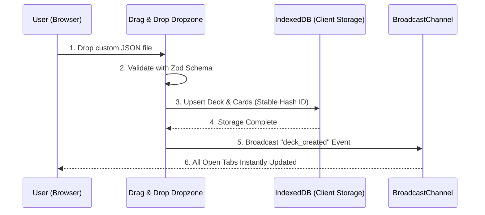
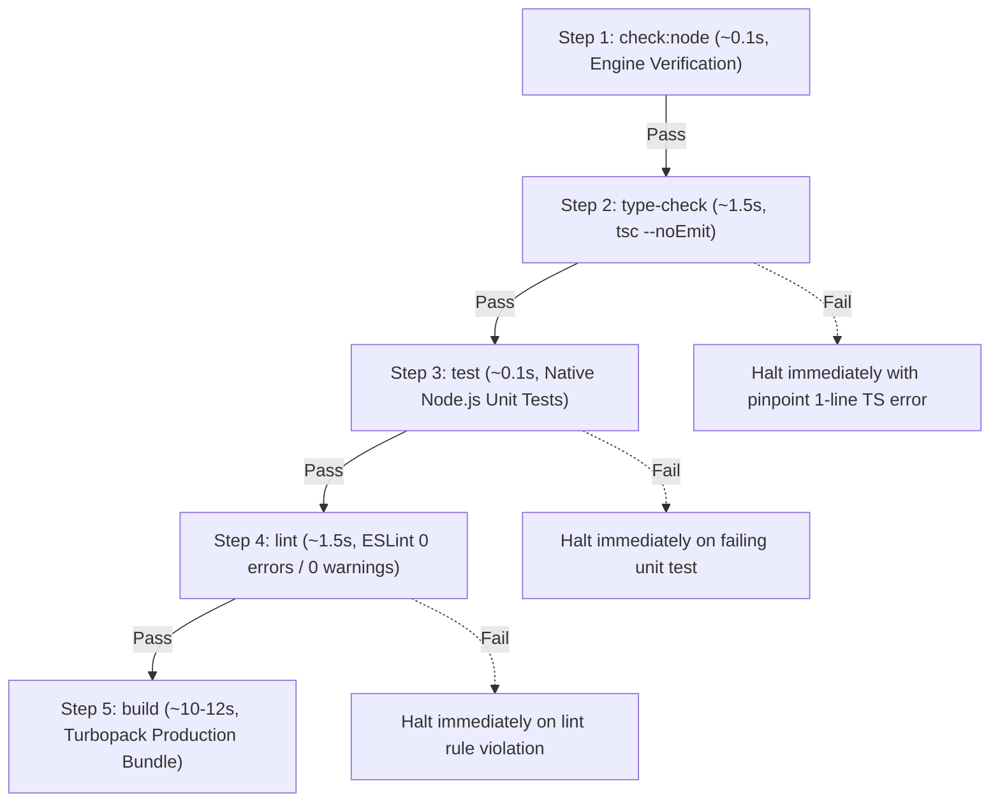
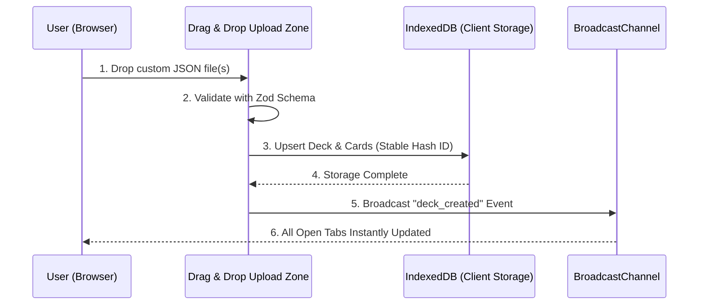

# System Architecture (시스템 아키텍처)

[🇰🇷 한국어](#-한국어) | [🇺🇸 English](#-english)

---

## 🇰🇷 한국어

이 문서는 `memorize_supporter` 프로젝트의 시스템 아키텍처를 정의합니다.

### 1. 개요 (Overview)

- **목적**: 사용자가 플래시카드(핀포인트 팁), 객관식 문제, 영단어 등을 효율적으로 암기할 수 있도록 돕는 범용 암기 애플리케이션입니다. 인지 과학적 원리(Active Recall, Spaced Repetition)와 포커스 모드 디자인을 채택하여 학습 효율을 극대화합니다.
- **핵심 컴포넌트**:
  - `DeckGallery`: `useDeferredValue`를 활용한 렌더링 최적화와 함께 실시간 덱 검색 및 시리즈 필터링을 담당하는 클라이언트 컴포넌트
  - `DeckEmptyState` (`src/components/home/DeckEmptyState.tsx`): 덱이 없을 때 최초 환영 온보딩, 3단계 학습 가이드 카드 및 샘플 덱 체험 액션을 전담하는 독립 프레젠테이션 컴포넌트
  - `ExamCardReview` (`src/components/cards/ExamCardReview.tsx`): 시험 모드 완료 후 개별 문항의 정답/오답 상세 리뷰 및 모달 오버레이를 전담하는 컴포넌트
  - `UploadZone`: 서버 전송 없이 브라우저 IndexedD   - `LocalRecordsView`: 로컬 기기에 저장된 시험 기록을 조회하고, 커스텀 확인 모달 기반 개별 기록 삭제 및 종합 JSON 백업 내보내기를 지원하는 통합 기록 뷰어 (고집중 Precision Canvas 단일 레이어 보더 및 시맨틱 뱃지 적용)
   - `ConfirmModal`: 파괴적 변경(덱 삭제, 복원 확인, 시험 기록 삭제) 시 브라우저 기본 팝업을 대체하여 WAI-ARIA Focus Trap, Return Focus, ESC 키 취소, 모바일 뷰포트 안전 스크롤(`max-h-[85vh]`) 및 정밀 버튼 디자인을 제공하는 접근성 중심의 프리미엄 확인 모달
   - `PageHeader` (`src/components/common/PageHeader.tsx`): 소개, 시험 기록, 데이터 관리, 데이터 준비 등 모든 서브 페이지의 일관된 시맨틱 뱃지, 단색 볼드 타이틀, 보조 설명 및 우측 액션 슬롯을 일원화한 공통 헤더 컴포넌트
   - `DataManagement` & `DataPreparation`: 웹 브라우저에서 직접 JSON 덱을 업로드/수정/삭제하고 단일 JSON 객체 스키마 규격 및 체계적인 [출력 규칙]을 갖춘 템플릿을 생성/검증/다운로드하는 관리 도구 (프롬프트/JSON 탭 분기 및 맞춤 복사 기능 지원)
   - `AboutClient` (`src/components/about/AboutClient.tsx`, `app/[lang]/about/page.tsx`): 인지 과학 및 Local-First 철학, 인터랙티브 3D 플립 카드 데모, 6대 기능 카드, 키보드 단축키 및 엔지니어링 기술 사양 테이블(100% i18n 지원)을 제공하는 브랜드 소개 뷰어
   - `IndexedDB 클라이언트 저장소` (`src/lib/client-db.ts`): 개인 소장 학습 데이터, 망각 곡선 진도 및 시험 점수를 브라우저에 안전하게 격리 보존하는 로컬 데이터 계층
   - `CardParser` (`src/lib/card-parser.ts`): 원시 JSON 및 카드 문자열을 Zod 스키마로 검증하여 `CardData` 판별 유니온으로 승격시키는 단일 진실 공급원(SSoT)

### 2. 프론트엔드 (Frontend)

- **프레임워크 및 라우팅 방식**:
  - Next.js (App Router) / React 19
  - Server Components(데이터 패칭: `app/[lang]/deck/[deckId]/page.tsx`, 정적 메타데이터: `app/[lang]/about/page.tsx`)와 Client Components(인터랙션: `Flashcard.tsx`, `AboutClient.tsx`)를 명확히 분리하여 렌더링 성능을 최적화합니다.

- **카드 출제 전략 (Card Selection Strategy)**:
  - **1순위 (미출제 문제)**: 학습 기록이 없는 카드를 최우선 출제하여 덱 전체 커버리지를 확보합니다.
  - **2순위 (오답 문제)**: 틀린 이력이 있는 카드를 추산된 '틀린 횟수'가 높은 순으로 배치하여 약점을 집중 타격합니다.
  - **3순위 (일반 문제)**: 완벽히 맞힌 카드는 '풀이 횟수'가 적은 순으로 출제하여 우연히 맞힌 지식을 확실히 굳힌 뒤, 장기 기억화된 카드를 나중에 복습하도록 설계되었습니다.

- **다국어 처리 및 UI 하드코딩 제로 전략 (i18n & Zero Hardcoded UI Text Policy)**:
  - **URL 기반 단일 진실 공급원(SSoT)**: URL 기반 동적 라우팅(`app/[lang]/...`)을 활용합니다. 전역 상태 관리자(Zustand 등)를 배제하여 SSR 렌더링 시점의 쿠키 분석에 의존하지 않고, Hydration 에러를 원천 차단합니다.
  - **UI 텍스트 하드코딩 절대 금지 (Zero Hardcoded UI Text Policy)**: 버튼, 헤딩, 본문, 뱃지, 태그, 힌트, placeholder, `aria-label`, 토스트, 코드 템플릿 라벨 및 기술 사양 테이블을 포함하여 사용자 대면 및 스크린 리더용 모든 UI 문자열의 인라인 하드코딩을 100% 엄격히 금지합니다.
  - **엄격한 타입 안전 다국어 사전**: `src/i18n/types.ts`를 단일 진실 공급원으로 삼아 한국어(`ko.ts`), 영어(`en.ts`), 일본어(`ja.ts`) 3개 국어의 번역 사전을 완전 동기화하고, 실제 사용자 흐름에 맞춘 직관적인 UX 카피라이팅을 적용합니다.
  - **프록시 기반 로캘 라우팅**: Next.js 16 규칙에 따라 `src/proxy.ts`를 사용하여 동적 로캘 라우팅을 처리합니다. 다국어 상수(locales)는 `src/i18n/settings.ts`로 분리하여 애플리케이션 전체에서 일관되게 관리합니다.

- **상태 관리 전략**:
  - 로컬 상태(`useState`)를 활용하여 현재 데크(Deck)의 학습 진행 상황과 플립 여부를 관리합니다. 복잡한 전역 상태 관리자(Redux 등)는 지양합니다.
  - **SPA 세션 재시작**: 학습 완료 후 전체 브라우저 새로고침(`window.location.reload()`)을 배제하고, 인메모리 상태 리셋(`handleStudyNewSession`)을 통해 지연 없는 부드러운 새 세션을 즉시 구동합니다.

- **스타일링, 마이크로 애니메이션 및 접근성 (Precision Canvas)**:
  - Tailwind CSS v4 (`@tailwindcss/postcss`)를 활용하여 딥 차콜 캔버스(`--color-background: #09090b`), 촉각적 카드 표면(`--color-card: #18181b`), 정밀한 1px 테두리(`--color-card-border: #27272a`), 통일된 인디고 프라이머리(`--color-primary: #6366f1`) 기반의 고집중 Precision Canvas 레이아웃을 제공합니다.
  - `globals.css` 파일에 Tailwind CSS v4의 `@theme` 및 `@utility` 지시어를 활용하여 글로벌 디자인 토큰 및 시맨틱 유틸리티(`.card-precision`, `.card-interactive`, `.btn-primary`, `.btn-secondary`, `.btn-ghost`, `.kbd-badge`, 3D 변환 등)를 정의하여 스타일 일관성과 유지보수성을 극대화했습니다.
  - **CJK 타이포그래피 최적화**: `globals.css`의 `body`에 `word-break: keep-all; overflow-wrap: anywhere;`를 전역 적용하여 한국어/일본어 어절이 음절 단위로 쪼개지는 현상을 방지하고, 좁은 모바일 뷰포트에서의 긴 텍스트 오버플로우를 차단합니다.
  - **가변 높이 및 모션 제어**: 퀴즈 카드 및 상호작용 컨트롤에 `AnimatePresence (initial={false})`와 `useReducedMotion`(`motion-reduce:` 변형자)을 적용하여 컨텐츠 길이에 맞춰 유연하게 조절하고, 모션 덜컹거림(Jitter)을 방지합니다.
  - **다중 선택 문항 개수 제한**: 정답 개수(`content.answers.length`)를 초과하여 선택할 수 없도록 동적으로 상한선을 제한하고, 실시간 진행 뱃지(`(1/2 선택됨)`) 및 안내 토스트를 제공하여 불필요한 중복 클릭을 방지합니다.
  - **전체 선택지 하이라이트 및 해설 강화**: 퀴즈 해설 및 결과 검토 화면에서 문제의 전체 선택지를 렌더링하고, 실제 정답(초록색), 사용자가 고른 오답(빨간색), 미선택 보기를 아이콘과 뱃지로 3중 강조하여 오답 원인을 직관적으로 학습할 수 있도록 지원합니다.
  - **단일 진실 공급원(SSoT) 스티키 헤더 및 공통 `QuizHeader` 컴포넌트**: 전역 헤더 높이 토큰과 완벽히 연동되는 재사용 가능한 `QuizHeader`를 도입하여 스크롤 시 글로벌 네비게이션 바로 아래(`sticky top-(--header-height) z-30`)에 안정적으로 고정됩니다. WAI-ARIA `role="progressbar"`, `aria-valuenow`, `aria-valuemin="0"`, `aria-valuemax="100"`, 다국어 `aria-label`을 완비하여 시각 장애 사용자에게도 실시간 진행 상태를 명확히 전달합니다.
  - **전역 문제 검토 네비게이션 및 시각적 키 뱃지 (`kbd-badge`)**: 시험 기록 및 오답 검토 화면에서 최상위 키보드 리스너(`Escape`, `←`, `→`)를 완비하여 플래시카드, 어휘, 퀴즈 전 종류에서 즉시 탐색이 가능하며, 헤더와 버튼에 `Esc`, `←`, `→` 시각적 키 뱃지를 일관되게 병기하여 키보드 우선 사용자의 인지 속도를 극대화했습니다.
  - **스트레칭 링크(Stretched Link) 기반 탭 스톱(Tab Stop) 최적화**: 덱 카드(`DeckCard`) 및 덱 리스트(`DeckListRow`)의 메인 타이틀 링크에 `after:absolute after:inset-0`를 적용하여 카드 전체 영역을 클릭 가능하게 확장하고, 하단 보조 버튼에 `tabIndex={-1} aria-hidden="true"`를 부여하여 키보드 탐색 시 동일 링크가 2회 중복 포커스되는 UX 피로도를 원천 해소했습니다.
  - Vercel Web Interface Guidelines를 철저하게 준수하여 시맨틱 HTML, WAI-ARIA 속성(`role="group"`, `role="progressbar"`, `aria-pressed`, `aria-label`), 장식용 SVG 아이콘 `aria-hidden="true"` 전수 적용, 견고한 키보드 포커스 대체 링(`focus-visible:ring-2 focus-visible:ring-indigo-500`), 고정폭 수치 폰트(`tabular-nums`), 그리고 모바일 터치 피드백(`active:scale-[0.98]`) 등 최고 수준의 접근성을 보장합니다.
  - 네이티브 브라우저 팝업을 전면 퇴출하고 WAI-ARIA Focus Trap 및 Return Focus를 완비한 `ConfirmModal`을 도입하여 모든 플랫폼에서 일관된 고집중 Precision 테마를 유지하는 동시에 엄격한 WAI-ARIA 다이얼로그 표준을 충족합니다.
  - `framer-motion`을 도입하여 180도 3D 플립, Scale Pop 등 절제된 시각적 피드백을 제공합니다.

- **PWA 및 메타데이터 전략**:
  - Progressive Web App (PWA) 표준인 `manifest.ts`를 구현하여 네이티브 디바이스 환경(테마 색상 동기화, Standalone 디스플레이 등)에 자연스럽게 녹아들도록 구성했습니다.
  - 동적 파비콘(`icon.tsx`) 및 고해상도 애플 아이콘(`apple-icon.tsx`) 생성 시, Satori 엔진의 중첩 SVG 렌더링 한계를 회피하기 위해 순수 SVG `<linearGradient>` 코드를 단일 레이아웃과 조합하여 크로스 브라우징 렌더링 안정성을 확보했습니다.
  - **브랜드 아이덴티티 및 아이콘 (The Deck)**: 두 장의 플래시카드가 부채꼴로 살짝 펼쳐진 미니멀 픽토리얼 마크로, 학습 카드 덱이라는 제품 본질을 직관적으로 표현합니다. 뒷장은 -8° 회전하여 '복사 아이콘'이 아닌 '카드 덱'으로 인식되며, 단 2색(`#a5b4fc` + `#0f172a`)의 스트로크 전용 디자인으로 파비콘(32px)에서도 선명하게 렌더링됩니다. `icon.tsx`(32×32), `apple-icon.tsx`(180×180), `<BrandLogo />` 컴포넌트를 통해 앱 전반에 걸쳐 일관된 브랜드 정체성을 제공합니다.

### 3. 백엔드 및 타입 아키텍처 (Backend & Type Architecture)

- **API 및 데이터 통신**:
  - 클라이언트 IndexedDB 및 정적 샘플 덱 엔드포인트를 통해 데이터를 공급합니다.

- **도메인 타입 아키텍처 ("Parse, Don't Validate")**:
  - **중앙화된 도메인 파서 (`src/lib/card-parser.ts`)**: DB에 저장된 원시 카드 문자열은 컴포넌트나 액션에서 `as unknown as CardData`와 같은 위험한 타입 단언으로 임의 캐스팅되지 않습니다. 모든 레코드는 `parseCardData(card)` 및 `parseCardDataList(cards)`를 통해 Zod 스키마로 런타임 검증된 후 정식 `CardData` 판별 유니온 타입으로 승격됩니다.
  - **강제 단언 0% 유지**: 코드베이스 전반에서 `as any` 및 `as unknown as`를 완전히 배제하여 컴파일 타임 및 런타임 무결성을 100% 보장합니다.

- **데이터 검증 및 에러 처리 (Zero-Trust)**:
  - **공유 스키마 (Zod)**: 클라이언트의 입력값은 절대 신뢰하지 않습니다. 5MB 용량 제한 검사부터 미식별 필드 제거까지, 모든 페이로드는 비즈니스 로직에 도달하기 전 반드시 재사용 가능한 Zod 스키마(`src/schemas/`)를 통해 엄격하게 검증됩니다.

- **데이터베이스 아키텍처 (100% Zero-Database & Local-First)**:
  - **Zero-Server Database**: 서버 측 데이터베이스(Prisma, SQLite, PostgreSQL 등)를 일체 사용하지 않으며, 서버리스 환경(Vercel 등)에서의 DB 연결 오류나 500 렌더링 충돌 위험을 원천 차단(0%)합니다.
  - **브라우저 영구 저장소 (IndexedDB)**: `decks`, `cards`, `progress`, `exam_results`의 모든 데이터는 사용자 브라우저의 클라이언트 저장소(`src/lib/client-db.ts`)에 단일화되어 보관됩니다.
  - **공개 샘플 덱 (Static Sample Decks)**: 기본 제공되는 공개 샘플 덱(웹 기초, JS 퀴즈, 생활 한국어, 비즈니스 영어)은 `input/public/*.json`에서 서버리스 환경 파일시스템 또는 API(`src/app/api/sample-decks/[deckId]`)를 통해 정적으로 제공됩니다.
  - **상세 시험 기록 추적**: 각 세션의 문제별 정오답 기록(사용자가 선택한 오답 포함)이 브라우저 IndexedDB의 `exam_results` 스토어에 영구 보존되며, 상세 오답 노트 및 백업/복원 기능을 100% 클라이언트 환경에서 제공합니다.

### 4. 데이터 파이프라인 (Data Pipeline)

- **클라이언트 사이드 통합 임포트 (`src/lib/client-db.ts` & Web Upload)**:
  - 사용자가 단어장/퀴즈 JSON 파일을 웹 UI(홈 화면 또는 데이터 관리 탭)에 Drag & Drop하면, 파일이 서버로 전송되지 않고 브라우저 메모리 상에서 Zod 스키마로 즉시 파싱 및 유효성 검증됩니다.
  - **데이터 무결성 보장 (Stable ID & Upsert)**: 문항의 텍스트 콘텐츠(Question/Front)를 기반으로 고유한 해시 식별자를 생성하여 IndexedDB에 저장합니다. 이를 통해 카드를 추가하거나 수정하더라도 기존 카드의 고유 ID가 유지되어 망각 곡선 복습 기록(`progress`)이 안전하게 보존됩니다.
  - **동일 탭 및 다중 탭 하이브리드 실시간 동기화**: `BroadcastChannel`(`memorize_db_events`)과 인메모리 `localListeners` 세트의 방어적 스냅샷 순회(`Array.from(localListeners)`)를 결합하여, 여러 탭뿐만 아니라 데이터를 수정한 현재 탭에서도 새로고침 없이 즉시 화면이 갱신되는 반응형 UX를 보장합니다.
  - **AI 프롬프트 생성기 최상위 객체 규격화**: 실제 덱 템플릿 및 Zod 스키마와 100% 일치하도록 단일 JSON 객체(`{ ... }`) 출력 지시와 분산된 주의사항을 통합한 `[출력 규칙]`을 정의하여 LLM의 생성 정밀도를 극대화했습니다.

### 5. Local-First BYOD 아키텍처 및 개인정보 보호 (BYOD Architecture)

- **제로 서버 BYOD(Bring Your Own Data) 원칙**:
  - 사용자의 개인 소장 학습 데이터, 비공개 노트 및 맞춤형 문제집은 중앙 웹 서버에 업로드하지 않고도 온디바이스에서 완전히 독립적으로 동작해야 합니다.
  - 본 애플리케이션은 사용자가 직접 준비한 JSON 덱을 드래그 앤 드롭하여 브라우저 로컬 IndexedDB에 직접 적재하는 Local-First BYOD 아키텍처를 제공하며, 서버로는 단 1바이트의 사용자 학습 데이터도 전송되지 않습니다.

- **IndexedDB 스토리지 계층 (`src/lib/client-db.ts`)**:
  - **오브젝트 스토어 구성**: `decks`(덱 메타데이터), `cards`(카드 내용), `progress`(에빙하우스 SRS 진도), `exam_results`(모의고사 점수 및 풀이 기록).
  - **인덱스 및 스키마 v2**: `deckId` 인덱스 외에 `exam_results`에 `createdAt` 인덱스를 추가하여 고속 역순 쿼리를 지원합니다.
  - **커넥션 풀링 및 싱글톤**: `cachedDbPromise`를 통해 연결 핸드셰이크 오버헤드를 제거하고, `onversionchange`를 처리하여 탭 간 블로킹을 방지합니다.
  - **스키마 무결성 및 호환성 검증**: 임포트되는 모든 JSON 문자열은 Zod `DeckSchema`를 통해 런타임 유효성 검사를 거친 후 저장됩니다. 외부에서 생성된 다양한 포맷이나 필드 누락(`category`, `tags`, `author` 등의 `null` 허용)에 대해 유연한 폴백 처리를 적용하여 파싱 실패율을 최소화했습니다.

- **브라우저 스토리지 영구 보존 및 진단 (Anti-Eviction & Diagnostics)**:
  - **영구 보존 보장 (`requestPersistentStorage`)**: Safari ITP의 7일 미사용 시 자동 스토리지 증발 및 디스크 부족 시 브라우저 강제 삭제(Eviction)를 방지하기 위해 `navigator.storage.persist()`를 연동합니다.
  - **용량 진단 (`getStorageEstimate`)**: `navigator.storage.estimate()`를 통해 현재 기기에서 사용 중인 용량(MB)과 영구 보존 상태를 사용자 UI에 직관적으로 제공합니다.

- **멀티 탭 실시간 동기화 (`BroadcastChannel`)**:
  - 웹 표준 `BroadcastChannel`을 활용하여 한 탭에서 덱 추가/삭제, 모의고사 응시, 백업 복원 발생 시 다른 열려있는 모든 탭의 덱 갤러리 및 기록 뷰가 새로고침 없이 즉각 동기화됩니다.

- **클라이언트 사이드 SRS 및 셔플링 (`src/components/cards/DeckClientLoader.tsx`)**:
  - 사용자가 로컬 덱 URL(`/deck/local_...`)로 진입하면 서버 컴포넌트가 `DeckClientLoader`로 위임합니다.
  - `DeckClientLoader`는 IndexedDB에서 카드와 학습 진도를 불러온 뒤, 서버와 100% 동일한 3단계 SRS 우선순위(미출제 -> 취약 문제 -> 일반 복습)와 Fisher-Yates 셔플 알고리즘을 적용하여 플레이어를 기동합니다.

- **데이터 라이프사이클 및 백업/복원 관리**:
  - 사용자는 개별 시험 기록을 삭제하거나, 원클릭으로 로컬 덱과 관련된 모든 진도 및 시험 기록을 단일 트랜잭션으로 영구 삭제할 수 있습니다.
  - 브라우저 캐시 삭제로 인한 데이터 유실을 방지하고 기기 간 데이터를 이전할 수 있도록, 종합 JSON 백업 내보내기(`exportLocalDataJson`) 및 백업 복원(`importBackupJson`)을 지원합니다.

- **PWA Service Worker 및 오프라인 App Shell 캐싱 (`public/sw.js`, `src/components/pwa/ServiceWorkerRegister.tsx`)**:
  - 데이터 계층(IndexedDB)의 완전한 오프라인 읽기/쓰기와 결합하여, 네트워크 단절(비행기 모드, 음영 지역) 상태에서도 정적 App Shell 및 Next.js JS/CSS 청크 번들이 로드되도록 Service Worker 캐싱을 지원합니다.
  - 정적 에셋(`/_next/static/*`)은 Cache-First, HTML 네비게이션 요청은 Network-First with Cache Fallback, 샘플 덱 API는 Stale-While-Revalidate 전략을 채택하며, 동적 런타임 캐시는 LRU 정책(최대 50개 항목 제한)으로 불필요한 스토리지 비대화를 방지합니다.
  - 새 버전 배포 시 즉시 활성화 배너(`SKIP_WAITING` 및 원클릭 새로고침)를 표시하여 캐시 파편화를 방지하고, 상단 글로벌 네비게이션에 네트워크 상태 뱃지(`NetworkStatusBadge`)를 바인딩하여 오프라인 감지 및 재연결 알림을 제공합니다.

### 6. 인프라 및 배포 (Infrastructure & Deployment)

- **배포 환경**:
  - 로컬(Self-hosted) 환경뿐만 아니라 Vercel 등의 서버리스 호스팅 플랫폼 배포도 완벽하게 지원합니다. 100% Zero-Database(Local-First) 구조이므로 외부 데이터베이스 커넥션 설정이나 DB 호스팅 비용 없이 정적/서버리스 환경에 즉시 배포 가능합니다.
- **CI/CD 파이프라인**:
  - GitHub Actions를 통해 Node 버전 검사, 정적 타입 검사(`npm run type-check`), ESLint 검사(`npm run lint`), Next.js 프로덕션 빌드(`npm run build`)를 자동 수행하여 무결성을 검증합니다.
- **환경 변수 관리**:
  - `.env` 파일을 통해 업로드 크기 상한(`NEXT_PUBLIC_MAX_UPLOAD_SIZE_MB`), 합격 점수(`NEXT_PUBLIC_PASS_MARK_PERCENT`) 등의 앱 정책 변수를 주입받으며, `src/lib/constants.ts`를 통해 중앙 집중식 NaN 방어 및 기본값 폴백 처리가 수행됩니다.

### 7. 검증 및 Fail Fast 파이프라인 (Verification & Fail Fast Pipeline)

- **Fail Fast, Fail Cheap 원칙**:
  - 검증 단계는 소요 시간과 컴퓨팅/토큰 비용 오름차순으로 엄격하게 배치됩니다.
  - 빠르고 비용이 저렴한 정적 검사를 먼저 수행하여 실패 시 즉시 중단(Short-Circuit)함으로써 무거운 빌드 과정의 토큰 및 시간 낭비를 원천 차단합니다.

- **파이프라인 명령어 체계**:
  - `npm run check:fast`: 개발 루프 중간에 빌드를 제외하고 Node 버전 → 타입 체크 → 단위 테스트 → 린트만 약 3초 만에 검증하는 초고속 루프 명령어 (LLM 턴 시간 및 토큰 절약).
  - `npm run type-check`: 컴파일 출력 없이 타입 무결성만 1.5초 만에 검증하는 초고속 정적 타입 체크 (`tsc --noEmit`).
  - `npm run test`: 외부 무거운 테스트 프레임워크(Jest, Vitest) 의존성 없이 Node 24 내장 `node:test`와 `node:assert/strict`로 0.1초 만에 실행되는 초경량 네이티브 단위 테스트.
  - `npm run lint`: 0 에러 / 0 경고를 엄격히 강제하는 ESLint 코드 스타일 및 품질 검사.
  - `npm run build`: Next.js Turbopack 프로덕션 번들 생성 및 정적 페이지 빌드.
  - `npm run check`: Node 버전 검사부터 타입 체크, 단위 테스트, 린트, 빌드를 순차 실행하며 실패 시 즉시 멈추는 전체 파이프라인.

### 8. 품질 및 진단 표준 (Quality & Diagnostics Standards)

- **Tailwind CSS v4 캐노니컬 표준**: v4 공식 유틸리티(`bg-linear-to-*`, `shrink-0`, `grow-0`, `top-(--header-height)`)를 엄격히 준수하며 구형 문법 및 CSS 충돌을 배제합니다.
- **ESLint 무결성**: `npm run lint` 실행 시 0 에러 / 0 경고를 상시 유지합니다.
- **맞춤법 검사 (cSpell)**: 프로젝트 도메인 용어 및 약어는 `.vscode/settings.json`의 `cSpell.words`에 등록하여 관리합니다.

---

## 🇺🇸 English

This document defines the system architecture of the `memorize_supporter` project.

### 1. Overview

- **Purpose**: A general-purpose memorization application designed to help users efficiently memorize flashcards (pinpoint tips), multiple-choice questions, and vocabulary. It maximizes learning efficiency by adopting cognitive science principles (Active Recall, Spaced Repetition) and a focus-mode design.
- **Core Components**:
  - `DeckGallery`: Client-side component for real-time deck search and series filtering, optimized with `useDeferredValue`.
  - `DeckEmptyState` (`src/components/home/DeckEmptyState.tsx`): Presentation component dedicated to the initial onboarding hero, 3-step visual guide, and sample deck import action.
  - `ExamCardReview` (`src/components/cards/ExamCardReview.tsx`): Dedicated component handling modal overlays and question-by-question review of correct/incorrect answers following exam completion.
  - `UploadZone`: Drag & Drop JSON importer in the data management page, supporting single and multi-file batch uploads directly into browser IndexedDB without server transmission.
  - `DeckPlayer`, `Flashcard`, `VocabularyCard`, `PracticeQuizCard`: Frontend interactive card renderer (handling micro-animations and feedback).
  - `DeckClientLoader`: Client-side deck runner that dynamically retrieves and prioritizes cards from IndexedDB for local-only decks.
  - `ExamResultView`: Comprehensive exam review interface supporting question-by-question replay, visual color-coded answer comparison, and "Retry Incorrect Only" session trigger.
  - `LocalRecordsView`: Unified exam records interface for on-device quiz history, upgraded with tactile double-layer deck card styling, ambient glow, and custom accessible modal confirmation on record deletion.
  - `ConfirmModal`: Premium accessible confirmation modal replacing native browser confirm dialogs for destructive actions (deck/record deletion), equipped with WAI-ARIA Focus Trap, Return Focus, Escape dismissal, mobile safe scroll (`max-h-[85vh]`), and pill-shaped action buttons.
  - `PageHeader` (`src/components/common/PageHeader.tsx`): Reusable sub-page header component standardizing pill badges, responsive gradient headings, descriptions, and action slots across about, records, data-management, and data-preparation pages.
  - `DataManagement` & `DataPreparation`: Web-based interactive interfaces for JSON deck uploads, metadata edits, real-time schema validation with single JSON object schema enforcement, unified [Output Rules], and mobile dynamic horizontal scroll fade indicators.
  - `AboutClient` (`src/components/about/AboutClient.tsx`, `app/[lang]/about/page.tsx`): Brand and product introduction interface presenting cognitive science and Local-First philosophies, an interactive 3D flip card demo, 6 core feature decks, keyboard shortcuts guidance, and an engineering technical specifications table (100% i18n support).
  - `IndexedDB Client Storage` (`src/lib/client-db.ts`): Browser-native persistence layer providing complete local isolation for private user study materials, forgetting curves, and quiz scores.
  - `CardParser` (`src/lib/card-parser.ts`): Single Source of Truth for Zod runtime-to-compile-time domain model promotion.

### 2. Frontend

- **Framework and Routing Strategy**:
  - Next.js (App Router) / React 19
  - Optimizes rendering performance by strictly separating Server Components (data fetching: `app/[lang]/deck/[deckId]/page.tsx`, static metadata: `app/[lang]/about/page.tsx`) and Client Components (interactions: `Flashcard.tsx`, `AboutClient.tsx`).

- **Card Selection Strategy**:
  - **Priority 1 (Unasked)**: Cards with no learning history are presented first to ensure full coverage of the deck.
  - **Priority 2 (Incorrect)**: Cards with a history of incorrect answers are prioritized next, sorted descending by their estimated failed count to target weaknesses.
  - **Priority 3 (General)**: Cards perfectly answered are presented last, sorted ascending by their review count to solidify newer knowledge before re-testing heavily drilled cards.

- **i18n Strategy & Zero Hardcoded UI Text Policy**:
  - **URL as Single Source of Truth (SSoT)**: Uses dynamic routing (`app/[lang]/...`) to manage the current language state. This prevents hydration errors caused by resolving language through cookies or local storage during SSR.
  - **Zero Hardcoded UI Text Policy**: Strictly prohibits inline hardcoding of any UI strings visible to users or read by screen readers, including buttons, headings, body text, badges, tags, hints, placeholders, `aria-label`, toasts, code template labels, and technical specification tables.
  - **Strictly Typed Translations (SSoT)**: Managed via `src/i18n/types.ts` as the single source of truth, synchronizing Korean (`ko.ts`), English (`en.ts`), and Japanese (`ja.ts`) with 100% type safety and natural product-oriented UX copywriting.
  - **Locale Routing via Proxy**: Adheres to Next.js 16 conventions by using `src/proxy.ts` for dynamic locale routing. Locale constants are isolated in `src/i18n/settings.ts` to maintain a single source of truth across the application.

- **State Management Strategy**:
  - Manages the learning progress and flip state of the current deck using local state (`useState`). Avoids using complex global state managers (like Redux).
  - **SPA Session Restart**: Eliminates destructive full-page browser reloads (`window.location.reload()`) upon session completion, instantly launching a fresh session via in-memory state reset (`handleStudyNewSession`).

- **Styling, Micro-animations, and Accessibility (Precision Canvas)**:
  - Focus-mode layout based on a deep charcoal canvas (`--color-background: #09090b`), tactile card surfaces (`--color-card: #18181b`), crisp 1px borders (`--color-card-border: #27272a`), and a unified indigo primary accent (`--color-primary: #6366f1`) using Tailwind CSS v4 (`@tailwindcss/postcss`).
  - Enhances code readability and maintainability by defining global semantic utilities (e.g., `.card-precision`, `.card-interactive`, `.btn-primary`, `.btn-secondary`, `.btn-ghost`, `.kbd-badge`, 3D transforms) and design tokens in `globals.css` via Tailwind CSS v4 `@theme` and `@utility` directives.
  - **CJK Typography Optimization**: Configures `word-break: keep-all; overflow-wrap: anywhere;` on `body` in `globals.css` to prevent unnatural word splitting in Korean and Japanese, while preventing text overflow in narrow mobile viewports.
  - **Adaptive Height & Motion Control**: Uses `AnimatePresence` with `initial={false}` and `useReducedMotion` (`motion-reduce:` variants) in cards and interactive controls to adapt smoothly to varying content lengths without layout jitter.
  - **Multiple-Choice Selection Constraint**: Dynamically restricts the maximum number of selectable options to the exact count of correct answers (`content.answers.length`), providing immediate toast feedback and live selection progress badges (`(1/2 selected)`) to prevent accidental excessive clicks.
  - **Comprehensive Explanation & Visual Highlights**: In quiz result/review views, displays all available choices (`content.options`) with color-coded and badged visual highlights (Emerald for correct answers, Rose for user-selected incorrect answers, and neutral for unpicked choices) to reinforce Active Recall.
  - **SSoT Sticky Header & Unified `QuizHeader` Component**: Implements a reusable `QuizHeader` (and matching `QuizHeader.Skeleton`) that sticks beneath the global navigation bar (`sticky top-(--header-height) z-30`). Fully equipped with WAI-ARIA `role="progressbar"`, `aria-valuenow`, `aria-valuemin="0"`, `aria-valuemax="100"`, and localized `aria-label` to communicate live progression clearly to screen reader users.
  - **Seamless Review Navigation & Shortcuts**: In exam history and question review views, provides top-level window keyboard listeners (`Escape`, `ArrowLeft`, `ArrowRight`) enabling immediate navigation across flashcards, vocabulary, and quizzes, paired with visible keyboard badges (`kbd-badge` for `Esc`, `←`, `→`) to maximize cognitive speed for keyboard-first users.
  - **Stretched Link Tab Stop Optimization**: In deck cards (`DeckCard`) and deck list rows (`DeckListRow`), applies `after:absolute after:inset-0` to the primary title link to stretch clickable area over the entire card, while assigning `tabIndex={-1} aria-hidden="true"` to secondary CTA buttons, eliminating redundant double tab stops during keyboard navigation.
  - Adheres strictly to Vercel Web Interface Guidelines for accessibility, including proper semantic HTML, WAI-ARIA attributes (`role="group"`, `role="progressbar"`, `aria-pressed`, `aria-label`), universal `aria-hidden="true"` on decorative SVG icons, robust keyboard focus replacement rings (`focus-visible:ring-2 focus-visible:ring-indigo-500`), fixed-width numeric typography (`tabular-nums`), and mobile touch feedback (`active:scale-[0.98]`).
  - Eliminates native browser alert/confirm popups in favor of accessible `ConfirmModal` dialogs featuring WAI-ARIA Focus Trap and Return Focus.
  - Provides visual feedback such as a 180-degree 3D flip and Scale Pop by integrating `framer-motion`.

- **PWA & Metadata Strategy**:
  - Implements a Progressive Web App (PWA) standard `manifest.ts` to seamlessly integrate with native device environments (e.g., theme color matching, standalone display).
  - Ensures cross-browser rendering reliability by using pure SVG `<linearGradient>` code for dynamic favicons (`icon.tsx`) and high-resolution Apple icons (`apple-icon.tsx`), bypassing Satori's nested SVG rendering limitations.
  - **Brand Identity & Iconography (The Deck)**: A minimal pictorial mark of two fanned flashcards representing a study deck. The back card is rotated -8° to distinguish it from a generic "copy" icon. Uses a strict 2-color palette (`#a5b4fc` stroke on `#0f172a` background) with no gradients, ensuring clarity even at favicon size (32px). Rendered consistently across `icon.tsx` (32×32), `apple-icon.tsx` (180×180), and the reusable `<BrandLogo />` component.

### 3. Backend & Type Architecture

- **API and Data Communication**:
  - Supplies data directly through client-side IndexedDB and static sample deck endpoints without an external database server.

- **Domain Type Architecture: "Parse, Don't Validate"**:
  - **Centralized Domain Parser (`src/lib/card-parser.ts`)**: Raw card strings stored in the database are never blindly cast using unsafe assertions like `as unknown as CardData`. All records are validated at runtime against Zod schemas and promoted to the strictly-typed `CardData` discriminated union.
  - **Zero Unsafe Assertions**: Ensures 0% `as any` or `as unknown as` assertions across the entire codebase.

- **Data Validation & Error Handling (Zero-Trust)**:
  - **Shared Schema (Zod)**: Client inputs are never trusted. Every payload (e.g., 5MB limit check, unknown field stripping) is strictly parsed through reusable Zod schemas (`src/schemas/`) *before* reaching the business logic.

- **Database Architecture (100% Zero-Database & Local-First)**:
  - **Zero-Server Database**: Does not use any server-side database (Prisma, SQLite, PostgreSQL, etc.), eliminating 100% of serverless DB connection errors and 500 rendering crashes.
  - **Browser Persistent Storage (IndexedDB)**: All data (`decks`, `cards`, `progress`, `exam_results`) is stored in the browser's client storage (`src/lib/client-db.ts`).
  - **Static Sample Decks**: Pre-packaged public sample decks are loaded statically from `input/public/*.json` or via `/api/sample-decks`.
  - **Detailed Exam History Tracking**: Question-by-question exam results (including chosen incorrect options) are stored permanently in the `exam_results` IndexedDB object store, providing detailed review and backup/restore entirely client-side.

### 4. Data Pipeline

- **Client-Side Unified Import (`src/lib/client-db.ts` & Web Upload)**:
  - When users drag & drop custom JSON study materials into the Web UI (Upload Zone on the Data Management page), files are decoded and validated in memory using Zod schemas with 0 bytes transmitted to any server.
  - **Data Integrity Guarantee (Stable ID & Upsert)**: Generates a deterministic MD5 hash identifier based on question/front text content. Even if cards are reorganized or updated, card IDs remain stable, safely preserving Ebbinghaus forgetting curve progress (`progress`).
  - **Hybrid In-Tab & Cross-Tab Real-time Synchronization**: Combines cross-tab `BroadcastChannel` with an in-memory `localListeners` set using snapshot iteration (`Array.from(localListeners)`). This ensures instant UI updates without manual reloads both in the active tab and across background tabs.
  - **AI Prompt Single Object Schema Alignment**: Enforces single JSON object (`{ ... }`) generation matching the exact deck schema and unifies all behavioral constraints under `[Output Rules]` for high LLM compliance.

### 5. Local-First BYOD Architecture & Privacy Protection

- **Zero-Server BYOD (Bring Your Own Data) Principle**:
  - User study materials, private notes, and custom flashcards must remain completely private and operable on-device without remote cloud transmission.
  - The application provides a Local-First BYOD architecture where decks and cards are imported directly into the user's browser IndexedDB via drag-and-drop, with 0 bytes transmitted to any server.

- **IndexedDB Storage Layer (`src/lib/client-db.ts`)**:
  - **Object Stores**: `decks` (deck metadata), `cards` (card contents), `progress` (Ebbinghaus SRS state), `exam_results` (quiz scores and answers).
  - **Indexing & Schema v2**: In addition to `deckId`, `exam_results` includes an index on `createdAt` for fast reverse-chronological retrieval.
  - **Connection Pooling & Singleton**: `cachedDbPromise` eliminates handshake overhead across calls, while handling `onversionchange` to prevent cross-tab upgrade blocking.
  - **Schema Validation & Resiliency**: All imported JSON strings are validated at runtime against Zod `DeckSchema` before being persisted. Tolerant parsing supports nullable/optional metadata (`category`, `tags`, `author`) to maximize compatibility with third-party and legacy deck files.

- **Storage Persistence & Diagnostics (Anti-Eviction & Diagnostics)**:
  - **Persistence Guard (`requestPersistentStorage`)**: Integrates `navigator.storage.persist()` to protect user study material and quiz progress from Safari ITP 7-day inactivity eviction and browser storage pressure wiping.
  - **Quota Diagnostics (`getStorageEstimate`)**: Leverages `navigator.storage.estimate()` to inspect storage usage (MB) and persistence status directly in the user interface.

- **Multi-Tab Reactive Synchronization (`BroadcastChannel`)**:
  - Employs standard `BroadcastChannel` to propagate deck creations, deletions, exam completions, and backup restorations across all open browser tabs in real time without manual reloads.

- **Client-Side SRS & Shuffling (`src/components/cards/DeckClientLoader.tsx`)**:
  - When navigating to a local deck URL (`/deck/local_...`), the server component delegates to `DeckClientLoader`.
  - `DeckClientLoader` loads cards and progress from IndexedDB and applies the exact same 3-tier SRS priority ordering (Unasked -> Weakest -> Review) and Fisher-Yates shuffle algorithm used by the server.

- **Data Lifecycle & Backup/Restore (`exportLocalDataJson`, `importBackupJson`, `deleteLocalDeck`, `deleteLocalExamResult`)**:
  - Users can delete individual local exam records or wipe an entire local deck with all associated progress in a single atomic transaction.
  - To prevent data loss when clearing browser cache and allow seamless data migration across devices, users can export and restore all on-device data via JSON backup files (`exportLocalDataJson` / `importBackupJson`).

- **PWA Service Worker & Offline App Shell Caching (`public/sw.js`, `src/components/pwa/ServiceWorkerRegister.tsx`)**:
  - Coupled with the IndexedDB data layer, a native Service Worker ensures that static App Shell bundles and Next.js JS/CSS chunks are cached, enabling full application startup and card study even in airplane mode.
  - Uses Cache-First for static assets (`/_next/static/*`), Network-First with Cache Fallback for HTML navigations, and Stale-While-Revalidate for sample deck APIs, with an LRU dynamic cache pruning policy (50 entries max) to prevent storage bloat.
  - Features an update prompt banner triggering `SKIP_WAITING` and one-click reload when a new service worker version is detected, while `NetworkStatusBadge` in the header provides real-time offline status and reconnection toasts.

### 6. Infrastructure & Deployment

- **Deployment Environment**:
  - Runs locally (Self-hosted) via `npm run build` as well as on serverless hosting platforms like Vercel. Because the application adopts a 100% Zero-Database (Local-First) architecture, it requires zero external database connections or DB hosting overhead.
- **CI/CD Pipeline**:
  - GitHub Actions automates Node version verification, TypeScript checking (`npm run type-check`), ESLint analysis (`npm run lint`), and Next.js production builds (`npm run build`) to ensure repository integrity on every push and pull request.
- **Environment Variable Management**:
  - Application limits and policies (such as `NEXT_PUBLIC_MAX_UPLOAD_SIZE_MB` and `NEXT_PUBLIC_PASS_MARK_PERCENT`) are configured via `.env` and centrally managed through `src/lib/constants.ts` with robust NaN defense and fallback defaults.

### 7. Verification & Fail Fast Pipeline

- **The "Fail Fast, Fail Cheap" Principle**:
  - Verification steps are ordered strictly by cost and execution speed.
  - Fast, token-efficient static checks are executed first, short-circuiting immediately upon any failure to avoid running heavy, token-expensive build processes.

- **Pipeline Commands**:
  - `npm run check:fast`: Rapid iterative dev loop check executing Node engine verification → Type Check → Unit Tests → Lint in ~3 seconds (saves LLM turn time and tokens).
  - `npm run type-check`: Ultra-fast TypeScript static check without emitting output files (`tsc --noEmit`).
  - `npm run test`: Zero-dependency native unit tests executing in ~0.1s using Node 24's built-in `node:test` and `node:assert/strict`.
  - `npm run lint`: Strict ESLint check enforcing 0 errors and 0 warnings.
  - `npm run build`: Production Next.js Turbopack compiler and static page generation.
  - `npm run check`: Chained all-in-one verification pipeline executing `check:node && type-check && test && lint && build`.

### 8. Quality & Diagnostics Standards

- **Tailwind CSS v4 Canonical Rules**: Strict adherence to v4 standard utilities (`bg-linear-to-*`, `shrink-0`, `grow-0`, `@theme` token references like `top-(--header-height)`). Zero CSS conflicts or obsolete syntax.
- **ESLint Zero Tolerance**: All PRs and commits must maintain 0 errors and 0 warnings on `npm run lint`.
- **Domain Spellcheck (cSpell)**: All project domain words, classes, and acronyms are registered and managed in `.vscode/settings.json` under `cSpell.words`.
